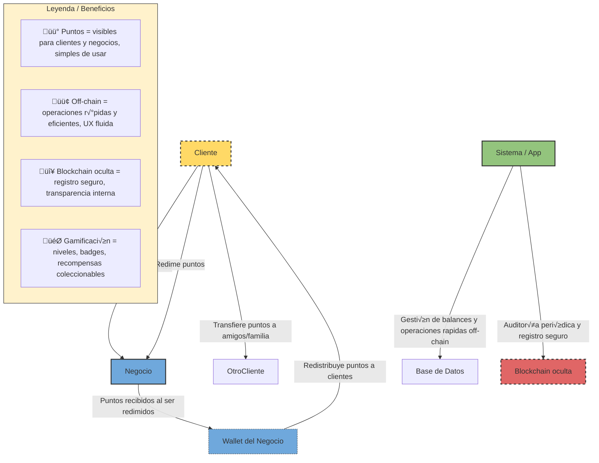
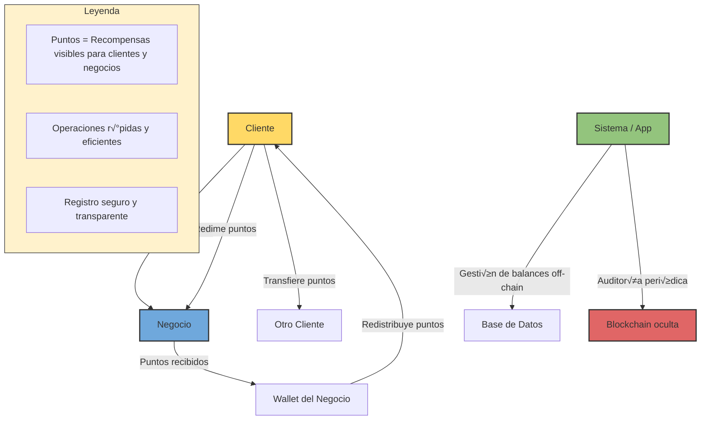

# 90. Diagramas

# The Rewards Bolivia – Diagrama Presentación Visual

```mermaid
flowchart TD
    %% Estilos de cajas
    style Cliente fill:#FFD966,stroke:#333,stroke-width:2px,stroke-dasharray: 5 5
    style Negocio fill:#6FA8DC,stroke:#333,stroke-width:2px
    style Sistema fill:#93C47D,stroke:#333,stroke-width:2px
    style Blockchain fill:#E06666,stroke:#333,stroke-width:2px,stroke-dasharray: 5 5
    style WalletNegocio fill:#6FA8DC,stroke:#333,stroke-width:1px,stroke-dasharray: 2 2
    style Leyenda fill:#FFF2CC,stroke:#333,stroke-width:1px

    %% Roles
    Cliente[Cliente]
    Negocio[Negocio]
    Sistema[Sistema / App]
    Blockchain[Blockchain oculta]

    %% Wallet del negocio
    WalletNegocio[Wallet del Negocio]

    %% Flujos de puntos
    Cliente -->|Compra y recibe puntos| Negocio
    Cliente -->|Redime puntos| Negocio
    Cliente -->|Transfiere puntos a amigos/familia| OtroCliente
    Negocio -->|Puntos recibidos al ser redimidos| WalletNegocio
    WalletNegocio -->|Redistribuye puntos a clientes| Cliente
    Sistema -->|Gestión de balances y operaciones rapidas off-chain| DB[Base de Datos]
    Sistema -->|Auditoría periódica y registro seguro| Blockchain[Blockchain oculta]

    %% Leyenda
    subgraph Leyenda["Leyenda / Beneficios"]
        Puntos["üü° Puntos = visibles para clientes y negocios, simples de usar"]
        OffChain["🟢 Off-chain = operaciones rápidas y eficientes, UX fluida"]
        OnChain["🔴 Blockchain oculta = registro seguro, transparencia interna"]
        Gamificacion["🎯 Gamificación = niveles, badges, recompensas coleccionables"]
    end

```

---

## üîπ Claves Visuales

1. **Colores y estilos**:
    - Amarillo ‚Üí Cliente / puntos visibles.
    - Azul ‚Üí Negocio / wallet.
    - Verde → Sistema / gestión off-chain.
    - Rojo → Blockchain / auditoría interna (oculta para usuarios).
    - Flechas sólidas → flujo principal de puntos.
    - Flechas punteadas → flujos internos o redistribución.
2. **Roles claramente definidos**:
    - Clientes: acumulan, canjean y transfieren puntos.
    - Negocios: emiten y reciben puntos, redistribuyen, gestionan campañas.
    - Sistema: maneja balances, QR codes y dashboard.
    - Blockchain: asegura transparencia, visible solo para auditoría interna.
3. **Gamificación integrada**:
    - Añadir iconos de badges, niveles y colecciones en la app visualmente.
    - Resaltar que incentiva interacción y retención.
4. **Ejemplo pr√°ctico para Notion**:
    - Debajo del diagrama, incluir una tabla de ejemplo de flujo de puntos:
        
        
        | Escenario | Acción | Puntos |
        | --- | --- | --- |
        | Compra | Cliente compra 50 Bs | +50 puntos |
        | Redención | Canjea 20 puntos | -20 puntos (van al negocio) |
        | Transferencia | Envía 10 puntos a amigo | -10 puntos del cliente, +10 puntos amigo |

```mermaid
flowchart TD
    style Cliente fill:#FFD966,stroke:#333,stroke-width:2px
    style Negocio fill:#6FA8DC,stroke:#333,stroke-width:2px
    style Sistema fill:#93C47D,stroke:#333,stroke-width:2px
    style Blockchain fill:#E06666,stroke:#333,stroke-width:2px

    Cliente[Cliente] -->|Compra y recibe puntos| Negocio[Negocio]
    Cliente -->|Redime puntos| Negocio
    Cliente -->|Transfiere puntos| OtroCliente[Otro Cliente]

    Negocio -->|Puntos recibidos| WalletNegocio[Wallet del Negocio]
    WalletNegocio -->|Redistribuye puntos| Cliente
    Sistema[Sistema / App] -->|Gestión de balances off-chain| DB[Base de Datos]
    Sistema -->|Auditoría periódica| Blockchain[Blockchain oculta]

    subgraph Leyenda["Leyenda"]
        style Leyenda fill:#FFF2CC,stroke:#333,stroke-width:1px
        Puntos["Puntos = Recompensas visibles para clientes y negocios"]
        OffChain["Operaciones r√°pidas y eficientes"]
        OnChain["Registro seguro y transparente"]
    end

```