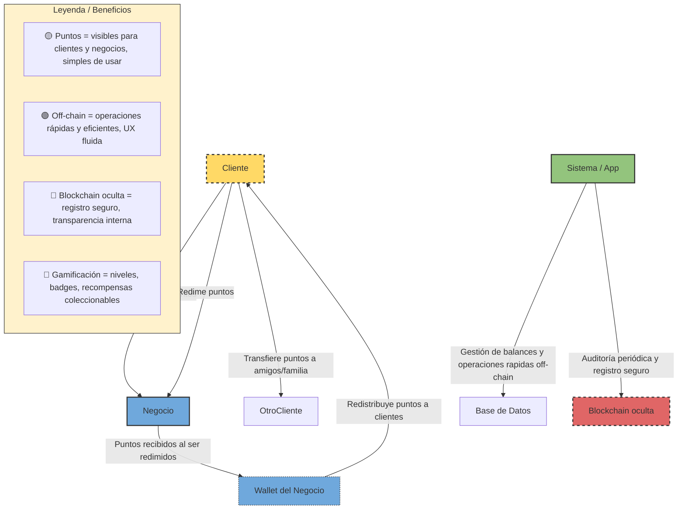
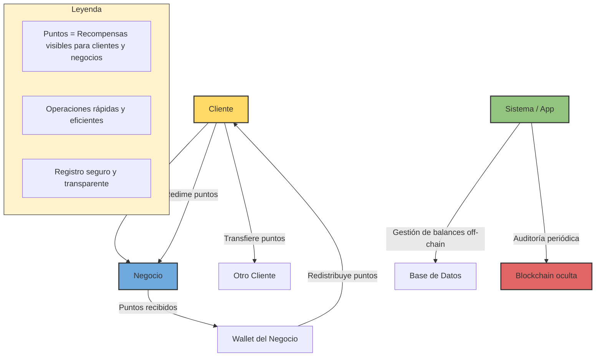

# 90. Diagramas

# The Rewards Bolivia – Diagrama Presentación Visual

---

## 🔹 Claves Visuales

1. **Colores y estilos**:
    - Amarillo → Cliente / puntos visibles.
    - Azul → Negocio / wallet.
    - Verde → Sistema / gestión off-chain.
    - Rojo → Blockchain / auditoría interna (oculta para usuarios).
    - Flechas sólidas → flujo principal de puntos.
    - Flechas punteadas → flujos internos o redistribución.
2. **Roles claramente definidos**:
    - Clientes: acumulan, canjean y transfieren puntos.
    - Negocios: emiten y reciben puntos, redistribuyen, gestionan campañas.
    - Sistema: maneja balances, QR codes y dashboard.
    - Blockchain: asegura transparencia, visible solo para auditoría interna.
3. **Gamificación integrada**:
    - Añadir iconos de badges, niveles y colecciones en la app visualmente.
    - Resaltar que incentiva interacción y retención.
4. **Ejemplo práctico para Notion**:
    - Debajo del diagrama, incluir una tabla de ejemplo de flujo de puntos:
        
        
        | Escenario | Acción | Puntos |
        | --- | --- | --- |
        | Compra | Cliente compra 50 Bs | +50 puntos |
        | Redención | Canjea 20 puntos | -20 puntos (van al negocio) |
        | Transferencia | Envía 10 puntos a amigo | -10 puntos del cliente, +10 puntos amigo |

