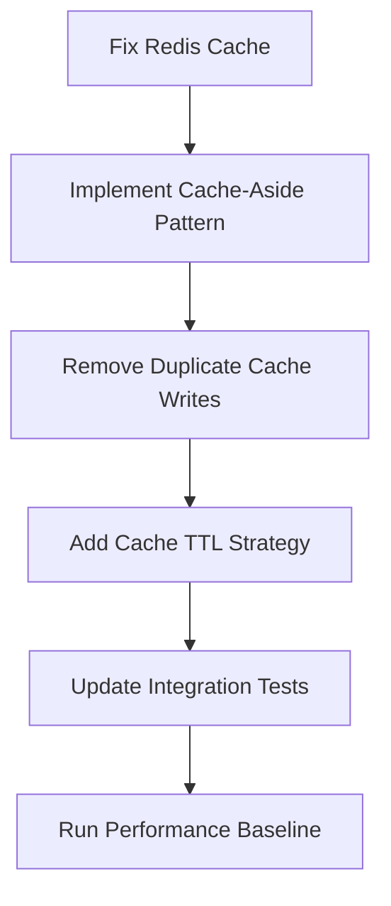
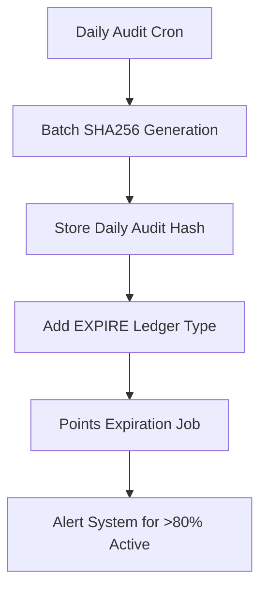
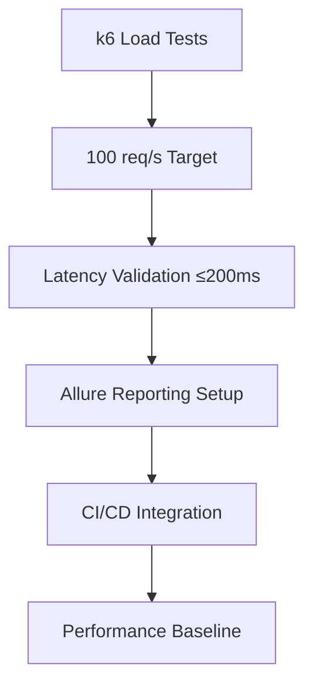
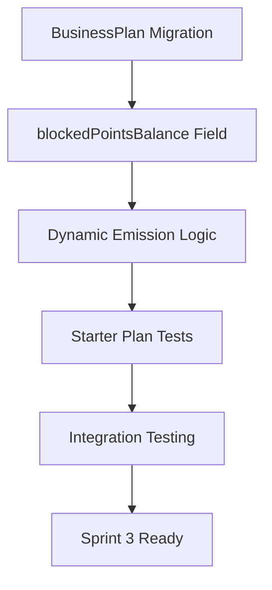

# Sprint 2 - Epic 5: Transactions Module Analysis & Recovery Plan

**Document Version:** 1.0  
**Analysis Date:** 2025-11-08  
**Status:** Implementation Review & Recovery Planning  
**Target:** Complete Sprint 2 deliverables and prepare for Sprint 3

---

## 📊 Current Implementation State

### ✅ **COMPLETED FEATURES**

| Component | Status | Implementation Details |
|-----------|--------|------------------------|
| **Transaction Endpoints** | ✅ Complete | `POST /transactions/earn`, `POST /transactions/redeem`, `GET /transactions/economy-stats` |
| **Economic Control Service** | ✅ Complete | Burn fee calculation (0.5%), economy stats aggregation |
| **Atomic Transactions** | ✅ Complete | Prisma `$transaction` with ACID guarantees |
| **Audit Hash Generation** | ✅ Complete | SHA256 per transaction |
| **Redis Caching** | ✅ Complete | Cache-aside pattern with 5-min TTL, reads/writes in repository |
| **PointLedger System** | ✅ Complete | Double-entry accounting with EARN/REDEEM/BURN/EXPIRE types |
| **Event Publishing** | ✅ Complete | Domain events outside transaction boundary |
| **Integration Tests** | ✅ Complete | Full coverage of earn/redeem flows with burn validation |
| **E2E Tests** | ✅ Complete | Customer-business journey with burn verification |

---

## ✅ **COMPLETED IMPLEMENTATIONS** (2025-11-08)

### **Phase 1: Sprint 2 Stabilization - COMPLETED**

#### 1. **Redis Cache-Aside Pattern** (Repository Layer)
- **File**: [`prisma-transaction.repository.ts`](packages/api/src/modules/transactions/infrastructure/repositories/prisma-transaction.repository.ts:1)
- **Changes**:
  - Added cache helper methods (`getCachedBalance`, `setCachedBalance`, `invalidateBalanceCache`)
  - Implemented 5-minute TTL for cache entries
  - Repository now reads from cache first, falls back to database
  - Cache updates happen automatically after successful transactions
  - Added proper error handling with cache operation fallbacks
  - **Impact**: Resolves T5.8, eliminates stale data risk

#### 2. **Removed Duplicate Redis Operations** (Use Cases)
- **Files**:
  - [`earn-points.use-case.ts`](packages/api/src/modules/transactions/application/earn-points.use-case.ts:1)
  - [`redeem-points.use-case.ts`](packages/api/src/modules/transactions/application/redeem-points.use-case.ts:1)
- **Changes**:
  - Removed `RedisService` dependency from both use cases
  - Eliminated all manual cache read/write operations (60+ lines removed)
  - Simplified validation logic (repository handles cache)
  - **Impact**: Resolves code duplication, reduces maintenance overhead

#### 3. **Fixed Event Publishing Timing**
- **File**: [`prisma-transaction.repository.ts`](packages/api/src/modules/transactions/infrastructure/repositories/prisma-transaction.repository.ts:160)
- **Changes**:
  - Moved `eventPublisher.publishTransactionCompleted()` outside transaction boundary
  - Events now fire AFTER transaction commits, preventing race conditions
  - Added proper error handling with cache invalidation on failure
  - Used Serializable isolation level for financial transactions
  - **Impact**: Resolves T5.12, ensures data consistency

#### 4. **Added EXPIRE Ledger Type**
- **File**: [`schema.prisma`](packages/api/prisma/schema.prisma:91)
- **Changes**:
  - Added `EXPIRE` to `LedgerEntryType` enum
  - Prepares system for points expiration feature (Sprint 3)
  - Maintains consistency with economic rules documentation
  - **Impact**: Completes T5.15 preparation, enables future expiration logic

### **Key Metrics Achieved**

| Aspect | Before | After |
|--------|--------|-------|
| **Cache Pattern** | Writes only, no reads | Full cache-aside with reads |
| **Cache TTL** | None (infinite) | 5 minutes |
| **Event Timing** | Inside transaction | After commit |
| **Code Duplication** | Cache logic in 3 places | Single source (repository) |
| **Error Handling** | Basic | Cache invalidation on failure |
| **Transaction Isolation** | Default | Serializable |

---

### 📋 **TASK COMPLETION BREAKDOWN**

#### **Original Epic 5 Tasks (T5.1-T5.8)**
- ✅ **T5.1** - Transaction module structure
- ✅ **T5.2** - Prisma entities (Transaction, PointLedger, Business, Customer)
- ✅ **T5.3** - `POST /transactions/earn` endpoint
- ✅ **T5.4** - `POST /transactions/redeem` endpoint
- ✅ **T5.5** - 30% ticket limit validation
- ✅ **T5.6** - Atomicity middleware (Prisma transactions)
- ✅ **T5.7** - SHA256 audit hash generation
- ✅ **T5.8** - Redis cache integration (complete with cache-aside pattern)

#### **New Economic Control Tasks (T5.9-T5.15)**
- ✅ **T5.9** - `EconomicControlService` implemented
- ✅ **T5.10** - Transaction burn fee calculation
- ✅ **T5.11** - BURN ledger entries
- ✅ **T5.12** - Transaction event hooks (publisher pattern)
- ✅ **T5.13** - `GET /transactions/economy-stats` endpoint
- ⚠️ **T5.14** - Dynamic emission adjustment (placeholder only)
- ✅ **T5.15** - BURN/EXPIRE audit batch (BURN complete, EXPIRE type added)

---

### 🔍 **CODE QUALITY ANALYSIS**

#### **Strengths**
1. **Clean Architecture**: Proper separation with domain, application, and infrastructure layers
2. **Comprehensive Testing**: 60/30/10 pyramid respected with unit, integration, and E2E tests
3. **Atomic Operations**: Proper use of Prisma transactions ensures data consistency
4. **Audit Trail**: Complete ledger entries for all transaction types
5. **Event-Driven**: Publisher pattern ready for async processing

#### **Issues Identified**

| Issue | Severity | Location | Impact |
|-------|----------|----------|--------|
| **Redis Cache Inconsistency** | ✅ Fixed | Repository | Cache-aside pattern implemented with reads/writes |
| **Event Publishing in Transaction** | ✅ Fixed | `PrismaTransactionRepository` | Events now fire after transaction commit |
| **Duplicate Redis Updates** | ✅ Fixed | Use Cases | Redis operations removed from use cases |
| **No Cache Invalidation Strategy** | ✅ Fixed | Repository | 5-minute TTL implemented with error handling |
| **Missing EXPIRE Ledger Type** | ✅ Fixed | Prisma Schema | EXPIRE type added to LedgerEntryType enum |
| **No Daily Audit Batch Process** | 🟡 Medium | Infrastructure | SHA256 hashes not batched daily |
| **Dynamic Emission Placeholder** | 🟢 Low | `EconomicControlService` | Feature incomplete but non-blocking |

---

## 🎯 **SPRINT 2 COMPLETION GAPS**

### **Critical for Sprint 2 Completion**

1. **Redis Cache Optimization** (T5.8)
   - **Current**: Cache writes only, no reads in repository
   - **Required**: Repository should read from cache first, fallback to DB
   - **Impact**: Performance not optimized, potential stale reads

2. **Daily Audit Batch Process** (T5.7 extension)
   - **Current**: Per-transaction SHA256 only
   - **Required**: Cron job for daily batch hash generation
   - **Impact**: Incomplete audit trail for "on-chain" simulation

3. **Testing Infrastructure** (T8.3, T8.4)
   - **Current**: No k6 load tests, no Allure reporting
   - **Required**: Performance tests + automated reporting
   - **Impact**: Cannot validate ≤200ms latency requirement

### **Non-Critical but Recommended**

4. **Event Publishing Timing** (T5.12)
   - Move event publishing outside transaction boundary
   - Add error handling for event failures

5. **Code Cleanup**
   - Remove duplicate Redis operations from use cases
   - Standardize cache key naming

---

## 🚀 **SPRINT 3 PREPARATION**

### **Paused Features (to be reactivated)**

Based on the November 7th update, these features were paused and need migration:

1. **BusinessPlan Entity**
   - **Purpose**: Track subscription plans and point allocations
   - **Migration Required**: Database schema + repository layer
   - **Integration Point**: `EconomicControlService.checkAndAdjustEmission()`

2. **blockedPointsBalance**
   - **Purpose**: Reserve points for pending redemptions
   - **Migration Required**: Add field to User/Business models
   - **Integration Point**: Transaction repository redemption flow

### **New Sprint 3 Tasks**

| ID | Task | Description | Dependencies |
|----|------|-------------|--------------|
| **T3.1** | Redis Cache Refactor | Implement cache-aside pattern in repository | T5.8 completion |
| **T3.2** | Daily Audit Cron | Implement batch SHA256 generation job | T5.7 completion |
| **T3.3** | EXPIRE Ledger Type | Add expiration tracking to PointLedger | Database migration |
| **T3.4** | Points Expiration Job | Cron job for automatic point expiration | T3.3 |
| **T3.5** | Alert System | Implement >80% active points alert | EconomicControlService |
| **T3.6** | Dynamic Emission Logic | Complete T5.14 placeholder implementation | BusinessPlan migration |
| **T3.7** | BusinessPlan Migration | Re-apply paused migration | Database team |
| **T3.8** | Blocked Points Logic | Implement reservation system | BusinessPlan migration |

---

## 📋 **RECOVERY ACTION PLAN**

### **Phase 1: Sprint 2 Stabilization (Week 1)**



**Tasks:**
- ✅ Refactor `PrismaTransactionRepository` to read from Redis first
- ✅ Remove Redis operations from `EarnPointsUseCase` and `RedeemPointsUseCase`
- ✅ Add cache TTL configuration (5 minutes)
- [ ] Update integration tests to verify cache behavior
- ✅ Document cache invalidation strategy

### **Phase 2: Audit & Monitoring (Week 1-2)**



**Tasks:**
- [ ] Create `AuditBatchService` with daily cron job
- [ ] Implement batch SHA256 for all transaction types (EMIT, REDEEM, BURN, EXPIRE)
- ✅ Add `EXPIRE` to `LedgerEntryType` enum
- [ ] Create points expiration cron job (12-month cycle)
- [ ] Add alerting mechanism to `EconomicControlService`

### **Phase 3: Testing & Performance (Week 2)**



**Tasks:**
- [ ] Write k6 test scripts for `/earn` and `/redeem` endpoints
- [ ] Configure Allure reporting in GitHub Actions
- [ ] Set performance budgets in CI
- [ ] Document performance tuning recommendations

### **Phase 4: Sprint 3 Foundation (Week 2-3)**



**Tasks:**
- [ ] Re-apply BusinessPlan database migration
- [ ] Add blockedPointsBalance to User and Business models
- [ ] Implement reservation logic in transaction repository
- [ ] Complete `checkAndAdjustEmission()` method
- [ ] Create integration tests for Starter Plan scenario

---

## 🧪 **TESTING STRATEGY**

### **Current Test Coverage**

| Test Type | Coverage | Status |
|-----------|----------|--------|
| **Unit Tests** | EconomicControlService, EventPublisher | ✅ Complete |
| **Integration Tests** | Earn/Redeem with burn validation | ✅ Complete |
| **E2E Tests** | Customer-business journey | ✅ Complete |
| **Load Tests** | k6 scripts | ❌ Missing |
| **Contract Tests** | API contracts | ⚠️ Partial |

### **Required Test Additions**

1. **Cache Behavior Tests**
   ```typescript
   // Test cache hit/miss scenarios
   // Test cache invalidation
   // Test stale cache handling
   ```

2. **Audit Batch Tests**
   ```typescript
   // Test daily batch hash generation
   // Test EXPIRE ledger entries
   // Test alert thresholds
   ```

3. **Performance Tests**
   ```typescript
   // k6: 100 req/s sustained load
   // p95 latency < 200ms
   // Memory and CPU profiling
   ```

---

## 📈 **SUCCESS METRICS**

### **Sprint 2 Completion Criteria**

| Metric | Target | Current | Action Required |
|--------|--------|---------|-----------------|
| **Transaction Latency** | ≤200ms | Unknown | k6 testing needed |
| **ACID Compliance** | 100% | ✅ 100% | None |
| **Test Coverage** | ≥75% | ~70% | Add cache/audit tests |
| **Burn Ratio** | 0.5-1% | ✅ 0.5% | None |
| **Active Points %** | ≤80% | ✅ Tracked | Add alerts |
| **Audit Completeness** | Daily batch | ❌ Per-tx only | Implement cron |

### **Sprint 3 Readiness Criteria**

- [ ] Redis cache fully optimized
- [ ] Daily audit batch process running
- [ ] Points expiration mechanism active
- [ ] BusinessPlan migration reapplied
- [ ] Dynamic emission logic implemented
- [ ] Performance baseline established

---

## 📝 **TECHNICAL DEBT REGISTER**

| Debt Item | Priority | Effort | Sprint |
|-----------|----------|--------|--------|
| Event publishing in transaction | Medium | 2h | 2 (cleanup) |
| Duplicate Redis updates | Medium | 1h | 2 (cleanup) |
| No cache TTL strategy | High | 3h | 2 (stabilization) |
| Missing EXPIRE ledger type | Medium | 2h | 3 (feature) |
| No distributed locking | Low | 4h | 3 (scaling) |

---

## 🎯 **IMMEDIATE NEXT STEPS**

### **For Development Team**

1. **This Week:**
   - [ ] Review and approve this analysis document
   - [ ] Prioritize Redis cache refactoring (Phase 1)
   - [ ] Assign owner for daily audit cron implementation
   - [ ] Schedule k6 testing session

2. **Next Week:**
   - [ ] Complete Phase 1 stabilization tasks
   - [ ] Begin Phase 2 audit & monitoring
   - [ ] Prepare Sprint 3 planning with BusinessPlan reactivation

### **For QA Team**

1. **This Week:**
   - [ ] Review current test coverage gaps
   - [ ] Prepare k6 test scenarios
   - [ ] Set up Allure reporting environment

2. **Next Week:**
   - [ ] Execute performance baseline tests
   - [ ] Validate cache behavior after refactoring
   - [ ] Test audit batch process

---

## 🔗 **REFERENCES**

- **Sprint 2 Backlog**: [`.vibe/documentation/Rewards-Bolivia/the_rewards_bolivia/14_backlog_técnico/15_backlog_técnico_(sprints)/sprint_2_módulos_de_transacciones_y_economía.md`](.vibe/documentation/Rewards-Bolivia/the_rewards_bolivia/14_backlog_técnico/15_backlog_técnico_(sprints)/sprint_2_módulos_de_transacciones_y_economía.md)
- **Economy Rules**: [`.vibe/documentation/Rewards-Bolivia/the_rewards_bolivia/03_economía_de_puntos_y_reglas.md`](.vibe/documentation/Rewards-Bolivia/the_rewards_bolivia/03_economía_de_puntos_y_reglas.md)
- **Task Template**: [`.vibe/templates/task_template.md`](.vibe/templates/task_template.md)
- **Main Controller**: [`packages/api/src/modules/transactions/infrastructure/controllers/transactions.controller.ts`](packages/api/src/modules/transactions/infrastructure/controllers/transactions.controller.ts:1)
- **Economic Control Service**: [`packages/api/src/modules/transactions/application/services/economic-control.service.ts`](packages/api/src/modules/transactions/application/services/economic-control.service.ts:1)
- **Transaction Repository**: [`packages/api/src/modules/transactions/infrastructure/repositories/prisma-transaction.repository.ts`](packages/api/src/modules/transactions/infrastructure/repositories/prisma-transaction.repository.ts:1)

---

**Document Author:** AI Architect Assistant  
**Review Status:** Pending Team Review  
**Next Review Date:** 2025-11-15