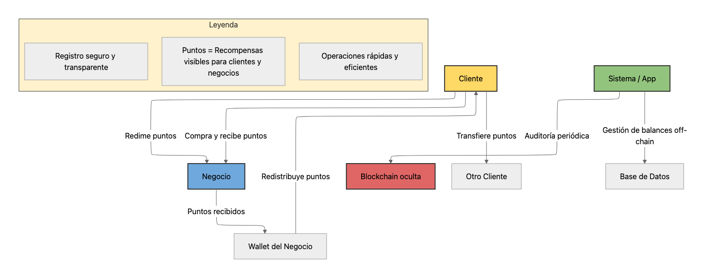
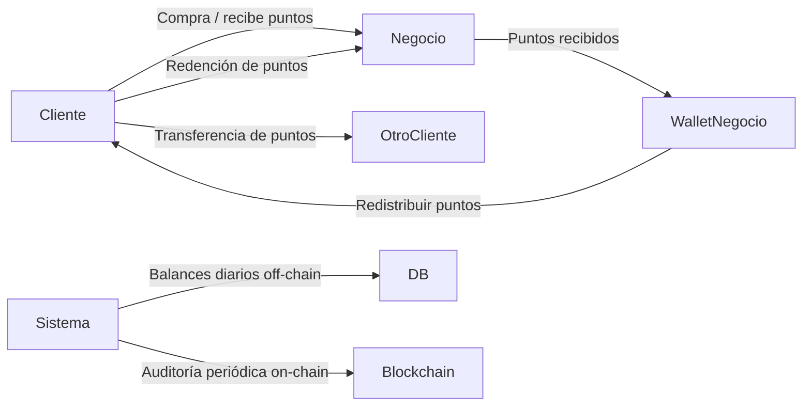

# 01. Visión General del Producto

## 🔹 Nombre del Product

**The Rewards Bolivia**

## 🔹 Objetivo

Crear un **ecosistema de fidelización local** que:

- Incentive a los clientes a comprar en negocios bolivianos mediante **puntos de recompensa**.
- Permita a los negocios **fidelizar clientes sin perder valor**, con un sistema híbrido de puntos limitados y puntos ilimitados opcionales.
- Ofrezca una experiencia **simple, gamificada e intuitiva**, mientras la tecnología blockchain se mantiene **oculta** para seguridad y auditoría.

---

## 🔹 Propuesta de Valor

### Para los clientes

- **Acumulación de puntos:** cada compra genera puntos según reglas definidas por el negocio.
- **Redención flexible:** usar los puntos para obtener descuentos, productos o servicios en cualquier comercio participante.
- **Gamificación:** niveles, badges y recompensas especiales que aumentan engagement y retención.
- **Transferencias entre usuarios:** enviar puntos a amigos o familiares dentro de la app.

### Para los negocios

- **Modelo híbrido de puntos:**
    - Puntos limitados incluidos en el plan de suscripción.
    - Puntos ilimitados opcionales para promociones especiales.
- **Recepción de puntos usados por clientes:** al redimir puntos, estos se acumulan en la billetera del negocio → incentiva que participen y los redistribuyan.
- **Dashboard completo:** estadísticas de clientes, flujo de puntos, campañas promocionales y rendimiento de ventas.
- **Integración QR:** emisión y redención de puntos instantánea en el punto de venta.

### Para el sistema

- **Gestión híbrida:**
    - **Off-chain** para balances rápidos y operaciones diarias.
    - **Auditoría periódica on-chain** para asegurar transparencia y trazabilidad, oculta para el usuario.
- **Escalable:** soporta múltiples comercios, usuarios y ciudades, con posibilidad de expansión nacional.

---

## 🔹 Diagrama Conceptual

**Explicación:**

1. Cliente compra → recibe puntos del negocio.
2. Cliente puede:
    - Canjear puntos en el mismo negocio u otros participantes.
    - Transferir puntos a otro usuario.
3. Negocio recibe los puntos redimidos → se acumulan en su billetera interna.
4. Negocio puede redistribuir puntos para fidelizar a nuevos clientes.
5. El sistema mantiene balances off-chain y registra las transacciones consolidando en blockchain para auditoría y seguridad.

---

## 🔹 Componentes Clave

| Componente | Funcionalidad | Beneficio |
| --- | --- | --- |
| **Clientes** | Acumular, canjear y transferir puntos | Incentivo de compra, fidelización, engagement |
| **Negocios** | Emitir puntos, recibir puntos usados, campañas promocionales | Incremento de ventas y retención de clientes |
| **Sistema (App)** | Gestión de puntos, QR code, dashboard, auditoría blockchain | Experiencia intuitiva, transparencia, escalabilidad |
| **Blockchain (opcional)** | Registro consolidado de transacciones | Confianza y trazabilidad sin complicar la UX |
| **Gamificación** | Niveles, badges, colecciones digitales | Mayor retención y motivación de usuarios |

---

💡 **Tip de comunicación:**

En la app y en la documentación para clientes y negocios, siempre usar **“puntos”**, explicando que internamente el sistema usa tecnología avanzada para **garantizar seguridad y transparencia**, sin necesidad de que ellos comprendan blockchain.

---